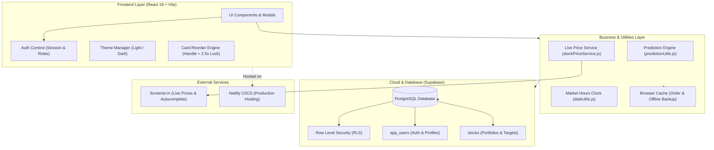

# 📈 PrediFolio — Stock Portfolio & Sell Prediction Tracker

[](https://react.dev/)
[](https://vitejs.dev/)
[](https://supabase.com/)
[](https://predifolio.netlify.app)
[](LICENSE)

> 🚀 **Live Demo:** [https://predifolio.netlify.app](https://predifolio.netlify.app)

**PrediFolio** is a modern, high-performance, and responsive stock market portfolio tracker and sell target forecaster built for Indian equities (NSE/BSE). Track investments, fetch live market prices, plan multiple sell target predictions with custom stock quantities, and intuitively organize your portfolio with drag-and-drop card reordering.

---

## 🌟 Key Features

### 1. 📊 Real-Time Portfolio Overview
- **Summary Metrics**: Live calculation of Total Invested Capital, Projected Portfolio Value, and Total Expected Profit/Loss.
- **Dynamic Indian Number Formatting**: Values formatted in Indian Rupee denomination (e.g., `₹1,50,000.00`).
- **Live Market Price**: Displays live stock values fetched from Screener.in with percentage change and P&L indicators.

### 2. 🎯 Multiple Sell Predictions & Targets
- **Multi-Target Planning**: Add multiple sell price targets for each stock.
- **Instant P&L Projections**: Calculates exact return percentage and total profit amount for each prediction.
- **Inline Editing & Deletion**: Quick inline editing of target prices without opening separate modals.

### 3. 🖐️ Drag & Drop Card Positioning
- **Instant Drag Handle**: Click and drag the `FiMove` icon to reposition cards immediately with zero delay.
- **2.5s Long-Press Activation**: Hold down anywhere on the card body for 2.5 seconds (with a smooth visual progress bar) to unlock card dragging.
- **Accidental Drag Protection**: Quick clicks, text selections, and double-clicks never accidentally trigger drag gestures.
- **Persistent Order**: Custom card positioning is automatically saved and preserved across browser sessions.

### 4. 🔍 Intelligent Stock Search & Autocomplete
- **Debounced Autocomplete**: Integrated with Screener's company database with a 1.5-second debounce to minimize network calls.
- **Smart Date Prefilling**: Buy dates prefill with local Indian Standard Time (IST).
- **Auto Calculated Quantities**: Enter buy price and quantity, and the total invested amount calculates automatically.

### 5. 🎨 Premium Glassmorphic UI & Themes
- **Dark & Light Modes**: High-contrast, meticulously tailored color palettes for both dark and light modes.
- **Micro-Animations**: Smooth hover transitions, interactive modal overlays, and haptic feedback.
- **CSV Portfolio Export**: Export your complete portfolio, targets, and notes into an Excel/CSV spreadsheet with one click.

---

## 🏗️ Project Architecture



### Architectural Highlights

1. **Component Hierarchy & Separation of Concerns**:
   - `App.jsx` acts as the root guard, displaying `<Login />` for unauthenticated visitors and `<Dashboard />` for signed-in users.
   - `<Dashboard />` maintains primary portfolio state, handling asynchronous fetches, updates, deletions, and modal visibility.
   - Modular child components (`<Header />`, `<SummaryBar />`, `<StockList />`, `<StockCard />`) receive props and emit callbacks for clean one-way data flow.

2. **Prediction & Cloud Persistence Engine**:
   - Multi-tier resolution strategy implemented in `predictionUtils.js`:
     1. Direct `sell_predictions` JSONB column in Supabase PostgreSQL (primary).
     2. Serialized `pred_json` payload stored in PostgreSQL `tags` column (cloud fallback ensuring instant persistence).
     3. Client-side `localStorage` cache for offline resilience.
     4. Legacy `sell_prediction_price` fallback.

3. **Multi-Tenant User Isolation**:
   - Portfolios are strictly partitioned by `user_id` in database queries and Row Level Security (RLS).
   - Card drag-and-drop ordering is persisted independently per user via localized storage keys (`stock_card_order_${user_id}`).

4. **Real-Time Market Status Engine**:
   - Indian Equity Market (NSE/BSE) operating clock validator (`dateUtils.js`) tracks trading hours (**Mon–Fri, 9:15 AM – 3:30 PM IST**).
   - Renders animated pulsating status indicators (`LIVE` vs `CLOSED`) with informational tooltips.

---

### 📂 Codebase Directory Structure

```text
stock-market-calci/
├── public/                    # Static favicon and public assets
├── src/
│   ├── components/            # UI components and feature modals
│   │   ├── Header.jsx         # App navigation, logo, and user profile pill
│   │   ├── Dashboard.jsx      # Core dashboard layout and stock state sync
│   │   ├── SummaryBar.jsx     # Valuation metrics and projected P/L calculations
│   │   ├── StockList.jsx      # Stock filters, sorting, and drag-and-drop container
│   │   ├── StockCard.jsx      # Stock card, live price banner, predictions & qty
│   │   ├── StockSearch.jsx    # Debounced company search via Screener autocomplete
│   │   ├── ExportButton.jsx   # CSV spreadsheet exporter
│   │   ├── Login.jsx          # Login/Signup forms with toggleable theme
│   │   ├── ProfileModal.jsx   # Account settings and password change modal
│   │   ├── AddStockModal.jsx  # New investment creation modal
│   │   ├── EditStockModal.jsx # Stock details edit modal
│   │   └── DeleteStockModal.jsx # Delete confirmation alert dialog
│   ├── context/
│   │   └── AuthContext.jsx    # Session management, persistence, and role state
│   ├── utils/
│   │   ├── predictionUtils.js # Target predictions extractor & cloud fallback loader
│   │   ├── stockPriceService.js# Screener API market price scraper & cache
│   │   └── dateUtils.js       # Indian market trading hours & IST date formatter
│   ├── styles/                # Modular CSS design system
│   │   ├── variables.css      # Design tokens (colors, gradients, glassmorphism)
│   │   ├── header.css         # Header and user badge styles
│   │   ├── dashboard.css      # Summary cards, grid, and empty states
│   │   ├── stockCard.css      # Card styles, prediction inputs, and badges
│   │   ├── modal.css          # Modal dialogs and password visibility inputs
│   │   └── login.css          # Auth screen, animated grid, and tabs
│   ├── supabaseSqlQuery/
│   │   └── schema.sql         # Supabase PostgreSQL schema, RLS, and migrations
│   ├── supabaseClient.js      # Supabase JS client configuration
│   ├── App.jsx                # Application root with authentication routing
│   └── main.jsx               # React DOM entry point
├── index.html                 # HTML5 document template & SEO metadata
├── netlify.toml               # Netlify SPA redirect rules & build commands
├── package.json               # Dependencies and scripts
└── README.md                  # Project documentation
```

---

## 🛠️ Tech Stack

| Technology | Purpose |
| :--- | :--- |
| **React 18** | Component-based UI logic and state management |
| **Vite** | Ultra-fast build tool and local development server |
| **Supabase** | Cloud PostgreSQL database with Row Level Security (RLS) |
| **Vanilla CSS** | Modern CSS variables, glassmorphism, responsive grid layout |
| **React Icons** | Feather Icons (`react-icons/fi`) for crisp iconography |
| **React Hot Toast** | Non-intrusive, customizable toast alerts |

---

## 🚀 Quick Start (Local Setup)

### 1. Clone the repository
```bash
git clone https://github.com/<your-username>/stock-market-calci.git
cd stock-market-calci
```

### 2. Install dependencies
```bash
npm install
```

### 3. Configure environment variables
Create a `.env` file in the root directory:
```env
VITE_SUPABASE_URL=https://your-project-id.supabase.co
VITE_SUPABASE_ANON_KEY=your-anon-public-key
```

### 4. Run development server
```bash
npm run dev
```
Open [http://localhost:5173](http://localhost:5173) in your browser.

---

## 📄 License

This project is open-source and available under the [MIT License](LICENSE).
