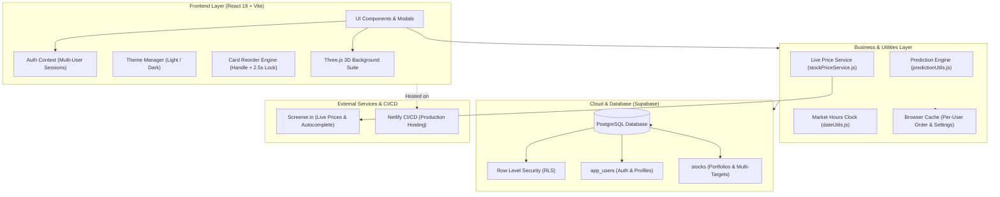

# 📈 PrediFolio — Stock Portfolio & Sell Prediction Tracker

[](https://react.dev/)
[](https://threejs.org/)
[](https://vitejs.dev/)
[](https://supabase.com/)
[](https://predifolio.netlify.app)
[](LICENSE)

> 🚀 **Live Demo:** [https://predifolio.netlify.app](https://predifolio.netlify.app)

**PrediFolio** is a modern, high-performance, and responsive stock market portfolio tracker and sell target forecaster built for Indian equities (NSE/BSE). Track investments, fetch live market prices, plan multiple sell target predictions with custom stock quantities, enjoy an interactive 3D financial background powered by Three.js, and intuitively organize your portfolio with drag-and-drop card reordering.

---

## 🌟 Key Features

### 1. 📊 Real-Time Portfolio Overview
- **Summary Metrics**: Live calculation of Total Invested Capital, Projected Portfolio Value, and Total Expected Profit/Loss.
- **Dynamic Indian Number Formatting**: Values formatted in Indian Rupee denomination (e.g., `₹1,50,000.00`).
- **Live Market Price**: Displays live stock values fetched from Screener.in with percentage change and P&L indicators.
- **Market Hours Status**: Operating clock validator (`dateUtils.js`) tracks Indian Equity Market trading hours (**Mon–Fri, 9:15 AM – 3:30 PM IST**) with live pulsating status badges.

### 2. 🎯 Multi Sell Predictions with Quantity Targets
- **Multi-Target Planning**: Save multiple sell price targets for each stock with customizable share quantities.
- **Instant P&L Projections**: Automatically calculates exact return percentage and net profit amount for each predicted target.
- **Clean Prediction Table**: Refined prediction table display with inline editing, quantity allocation, and one-click deletion.

### 3. 🌐 Immersive 3D Financial Background (Three.js & SVG)
- **Interactive WebGL Canvas**: Ambient 3D scene built with `@react-three/fiber` and `@react-three/drei`:
  - **Micro Candlesticks**: Finely proportioned 3D candlesticks illustrating market volatility.
  - **Dynamic Trendlines**: Edge-to-edge algorithmic moving trendlines across the scene.
  - **Perspective Financial Grid**: Moving 3D floor grid with adaptive theme contrast.
  - **Data Particles**: Snapped data particles streaming along grid coordinate lines.
- **Fluid Header Wave SVG**: Custom undulating wave arch with top-to-bottom opacity falloff, delicate light contour lines, and full-screen width ribbon overlap.
- **Context-Aware Positioning**: Positioned directly beneath the `<Header />` on the dashboard (`top: var(--header-height, 72px)`) and across the full viewport on Login/Signup.

### 4. 🖐️ Drag & Drop Card Positioning
- **Instant Drag Handle**: Click and drag the move handle icon to reposition stock cards immediately with zero delay.
- **2.5s Long-Press Activation**: Hold down anywhere on the card body for 2.5 seconds (with a smooth visual progress bar) to unlock card dragging.
- **Accidental Drag Protection**: Quick clicks, text selections, and double-clicks never accidentally trigger drag gestures.
- **Persistent Order**: Custom card positioning is automatically saved per user and preserved across browser sessions.

### 5. 👥 Multi-User & Account Management
- **Multi-Login System**: Secure user authentication and session management via Supabase / custom auth context.
- **Profile Settings Modal**: Change passwords, update profile details, and manage credentials directly from the header.
- **Personalized Header Pill**: Shows user display name, `@username` handle, and dynamic avatar badge.

### 6. 🎨 Curated Dual Themes (Dark & Light)
- **Light Theme**: Deep Vestor teal header bar (`linear-gradient(135deg, #022320, #06403a)`) with high-contrast white card inner components (user pill, theme toggle, logout button) for crystal-clear readability.
- **Dark Theme**: Deep obsidian `#0a0e17` with midnight-teal accents, glare-free 3D contours, and high-contrast metric cards.
- **Theme Persistence**: Instant theme toggling saved automatically in `localStorage`.
- **CSV Portfolio Export**: Export your complete portfolio, targets, and notes into an Excel/CSV spreadsheet with one click.

---

## 🏗️ Project Architecture



---

## 📂 Codebase Directory Structure

```text
stock-market-calci/
├── public/                    # Static favicon and public assets
├── src/
│   ├── components/            # UI components and feature modals
│   │   ├── Header.jsx         # Navigation bar, brand title, user pill & logout
│   │   ├── ThemeToggle.jsx    # Light / Dark theme toggle button
│   │   ├── Dashboard.jsx      # Core dashboard layout and stock state sync
│   │   ├── SummaryBar.jsx     # Valuation metrics and projected P/L calculations
│   │   ├── StockList.jsx      # Stock filters, sorting, and drag-and-drop container
│   │   ├── StockCard.jsx      # Stock card, live price banner, predictions & qty
│   │   ├── StockSearch.jsx    # Debounced company search via Screener autocomplete
│   │   ├── ExportButton.jsx   # CSV spreadsheet exporter
│   │   ├── Login.jsx          # Login/Signup forms with toggleable theme
│   │   ├── ProfileModal.jsx   # Account settings and password change modal
│   │   ├── AddStockModal.jsx  # New investment creation modal
│   │   ├── EditStockModal.jsx # Stock details edit modal
│   │   ├── DeleteStockModal.jsx # Delete confirmation alert dialog
│   │   └── ThreeJS/           # Interactive 3D financial background suite
│   │       ├── FinancialBackground.jsx # Background controller & Canvas layout
│   │       ├── BackgroundWaveSvg.jsx   # Top fluid wave arch with contour lines
│   │       ├── Candlesticks.jsx        # Micro 3D animated financial candlesticks
│   │       ├── TrendLines.jsx          # Edge-to-edge algorithmic moving trendlines
│   │       ├── FinancialGrid.jsx       # 3D perspective floor grid with theme contrast
│   │       └── DataParticles.jsx       # Snapped coordinate stream particles
│   ├── context/
│   │   ├── AuthContext.jsx    # Multi-user session management & persistence
│   │   └── ThemeContext.jsx   # Theme provider (light/dark) & document sync
│   ├── utils/
│   │   ├── predictionUtils.js # Target predictions extractor & cloud fallback loader
│   │   ├── stockPriceService.js# Screener API market price scraper & cache
│   │   └── dateUtils.js       # Indian market trading hours & IST date formatter
│   ├── styles/                # Modular CSS design system
│   │   ├── index.css          # Design tokens, reset, theme variables & wrapper styles
│   │   ├── header.css         # Header, brand styling & high-contrast user pill
│   │   ├── dashboard.css      # Summary cards, dashboard layout & empty states
│   │   ├── stockCard.css      # Card styles, prediction inputs, and badges
│   │   ├── modal.css          # Modal dialogs and password visibility inputs
│   │   └── login.css          # Auth screen, animated grid, and tabs
│   ├── supabaseSqlQuery/
│   │   └── schema.sql         # Supabase PostgreSQL schema, RLS, and migrations
│   ├── supabaseClient.js      # Supabase JS client configuration
│   ├── App.jsx                # Application root with authentication routing
│   └── main.jsx               # React DOM entry point
├── .npmrc                     # Netlify & CI/CD peer dependency configuration
├── index.html                 # HTML5 document template & SEO metadata
├── netlify.toml               # Netlify SPA redirect rules & build commands
├── package.json               # Dependencies, scripts & React 19 overrides
└── README.md                  # Project documentation
```

---

## 🛠️ Tech Stack

| Technology | Purpose |
| :--- | :--- |
| **React 19** | Modern UI component rendering and reactive state management |
| **Three.js & R3F** | 3D WebGL financial background via `@react-three/fiber` & `@react-three/drei` |
| **Vite** | Lightning-fast build tool and local development server |
| **Supabase** | Cloud PostgreSQL database with Row Level Security (RLS) |
| **Vanilla CSS** | Modern CSS variables, glassmorphism, responsive grid layout |
| **React Icons** | Feather Icons (`react-icons/fi`) for crisp iconography |
| **React Hot Toast** | Non-intrusive, customizable toast alerts |

---

## 🚀 Quick Start (Local Setup)

### 1. Clone the repository
```bash
git clone https://github.com/harshit2490/stock-market-calci.git
cd stock-market-calci
```

### 2. Install dependencies
```bash
npm install
```

### 3. Configure environment variables
Create a `.env` file in the root directory:
```env
VITE_SUPABASE_URL=https://your-project-id.supabase.co
VITE_SUPABASE_ANON_KEY=your-anon-public-key
```

### 4. Run development server
```bash
npm run dev
```
Open [http://localhost:5173](http://localhost:5173) in your browser.

### 5. Build for production
```bash
npm run build
```

---

## 🌐 Deployment (Netlify)

This project is configured for continuous deployment on [Netlify](https://www.netlify.com/):
- **Build Command**: `npm run build`
- **Publish Directory**: `dist`
- **SPA Routing**: Configured via `netlify.toml` for client-side routing.
- **Dependency Compatibility**: Includes `.npmrc` (`legacy-peer-deps=true`) and React 19 `overrides` in `package.json` to guarantee zero-error installs on npm 11.

---

## 📄 License

This project is open-source and available under the [MIT License](LICENSE).
